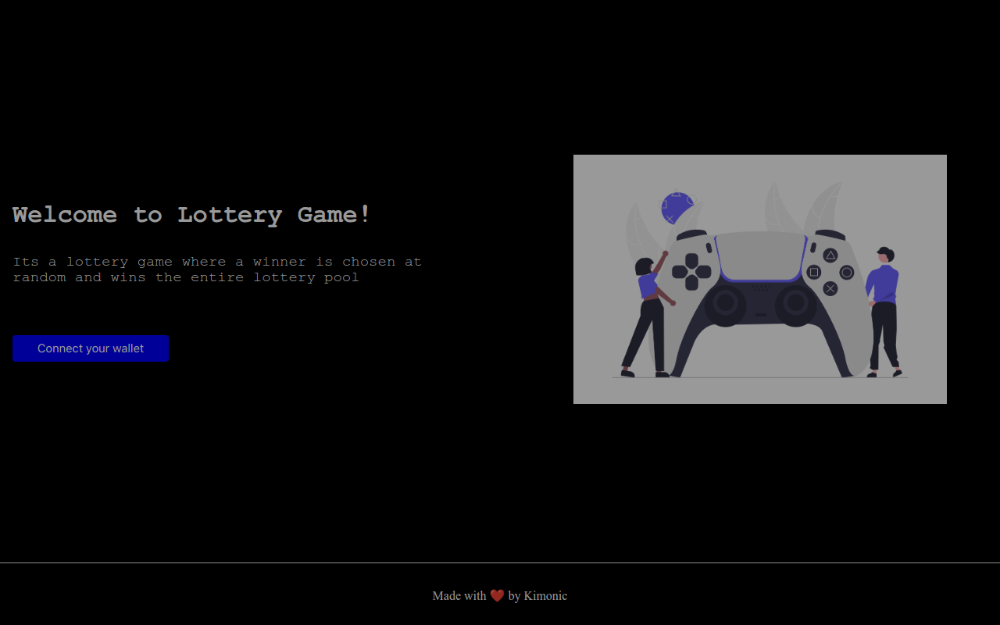

# 💎 Fullstack Basic Lottery Game🎮  

### [Play On 💎🎮](https://basic-lottery-game.vercel.app/) ⏩ https://basic-lottery-game.vercel.app/

## Project Description 📝

### Fullstack Basic Lottery Game 🎮 Using Chainlink VRF 💎 

- Player can connect to the mini game using Metamask on Mumbai Network
- There is a maximum number of players per game.
- After max number of players have entered the game, one winner is chosen at random
- The winner will get maxplayers*entryfee amount of ether for winning the game


## Project Demo GIF 🎥


## Directory Structure 📂
- `backend/contracts` ⏩ Smart Contract Code [Deployed @ Mumbai Test Network]
- `frontend` ⏩ Project's Next frontend.
- `graph` ⏩ Graph for indexing.

## How Does Chainlink VRF work ❓
Chainlink VRF (Verifiable Random Function) is a provably-fair and verifiable source of randomness designed for smart contracts. 
Smart contract developers can use Chainlink VRF as a tamper-proof random number generator (RNG) to build reliable smart contracts 
for any applications which rely on unpredictable outcomes.

## Run this project locally 🏃🏾‍♂️💨

```shell
git clone https://github.com/Kimonic99/Basic-LotteryGame.git
```

### Frontend 🎨🖌

- `cd frontend`
- `npm install` Install Dependencies
- `npm run dev` Start the frontend in localhost 
- Open `http://localhost:3000` <br />
We can use the localhost frontend to interact with the smart contract on Mumbai Network

### Backend 🔗

- `cd backend`
- `npm install` Install Dependencies
- `npx hardhat --version` Check if Hardhat is properly installed 
- `npx hardhat compile` Compile the Smart Contract
- `npx hardhat test` Test the Smart Contract Locally
- `npx hardhat run scripts/deploy.js` Deploy the Smart Contract Locally


### 💎 Lottery Game Contract Address 💎
[🚀 0x500e6c232906bFaa097C41927c5cb823DCbF4E61 🛸](https://mumbai.polygonscan.com/address/0x500e6c232906bFaa097C41927c5cb823DCbF4E61#code)
